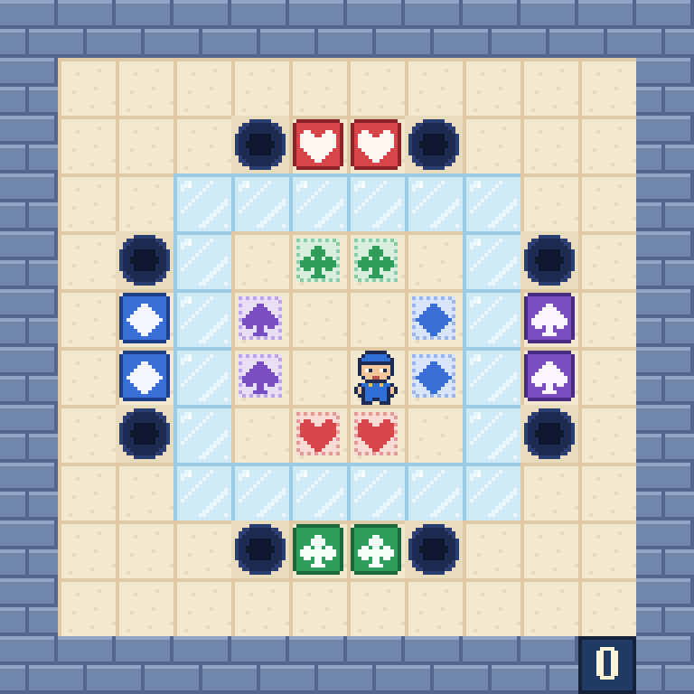

# El Cubo de Hielo

Ocho cajas de cuatro palos rodean un cubo de hielo. Sus dianas están dentro, cada pareja en el lado contrario, y para
llegar hay que cruzar el hielo, donde todo patina, sin caer en ninguno de los ocho agujeros. Juego web autónomo en
**PuzzleScript Next**, con pixel-art 16-bit propio y tarjetas ilustradas con todas las reglas.

## Cómo se juega
- **Objetivo:** lleva cada caja a una diana de su palo (corazones, tréboles, diamantes y picas; dos de cada). Una caja en su diana se ribetea de oro.
- **Flechas:** mover · **Z:** deshacer · **R:** reiniciar.
- **En el móvil:** desliza el dedo para moverte; deshacer y reiniciar están arriba a la derecha.
- **Hielo:** lo que entra patina en línea recta hasta salir o chocar; todo el patinazo es un solo paso. Quien empuja no patina, y el mozo que patina hacia una caja se para delante sin empujarla.
- **Agujeros:** una caja que cae dentro lo tapa y se pierde (y sin ella ya no se puede ganar); si cae el mozo, se acaba la partida. Hay que deshacer o reiniciar.
- **Ayudas** (arriba a la derecha): el **ojo**, **reiniciar**, la **pista** (un movimiento hacia la solución en cada pulsación, desde donde estés), **deshacer** (un movimiento atrás cada vez) y **solución** (reinicia y la reproduce, un movimiento cada 0,7 segundos; pulsada otra vez hace pausa, y con ella salen **atrás** y **adelante**, de movimiento en movimiento). Una tecla o un toque en el tablero devuelve el mando al jugador.
- **Final:** al resolver el puzzle, la imagen final no desaparece: se queda hasta que pulses **reiniciar** (la tecla R o el botón) o **deshacer** (para probar otra solución).

## Créditos
- Recreación, arte 16-bit y tarjetas: **Spider** (Fali + Claude), 2026
- Nivel original: PGT («ice cube», sokobanonline.com, 2024)
- Motor: [PuzzleScript Next](https://github.com/david-pfx/PuzzleScriptNext) (derivado de PuzzleScript de increpare), incrustado en un único `index.html`
- Fuente del juego: [`juego.txt`](juego.txt)
